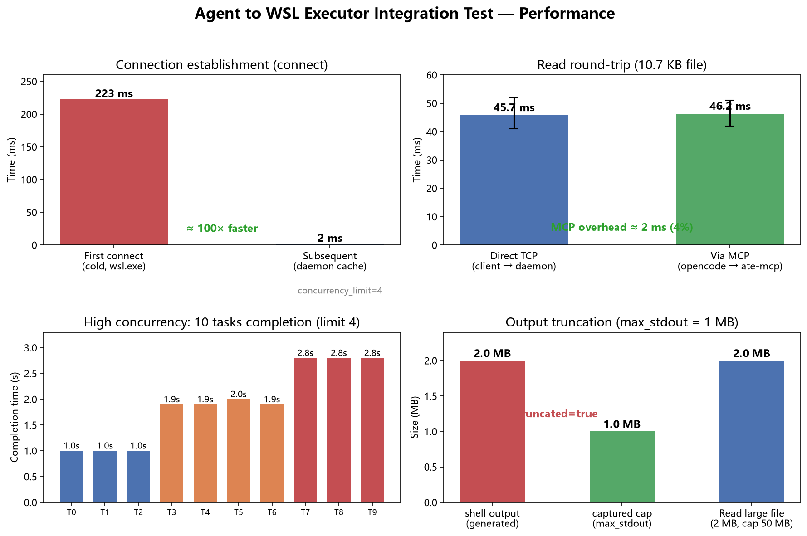

# Agent to WSL Executor Integration Test Report

**Date**: 2026-08-15
**Branch**: `main`
**Target**: `ate-mcp` (MCP server) → `windows-agent-client` → `wsl-executor-daemon` full path

## 1. Overview

This report summarizes the complete test results for calling the WSL executor
from an agent (opencode) through MCP, covering: functional verification,
performance benchmarks, the release/distribution path, and issues found and
fixed.

**Components under test**:

| Component | Role |
| --- | --- |
| `ate-mcp` | MCP stdio server exposing daemon tools as MCP tools |
| `windows-agent-client` | Windows TCP client with daemon discovery and connection cache |
| `wsl-executor-daemon` | Persistent WSL service executing tools (Read/Write/Edit/Glob/Grep/WebFetch/shell + plugins) |
| `ate-cli` | Windows plugin-management CLI |

**Test environment**:
- Windows 11, WSL2 (Ubuntu, kernel 5.15.167.4)
- Rust 1.96.0, tokio 1.53
- Daemon: current `main` build at `~/.local/bin/ate-daemon`

## 2. MCP functional verification

### 2.1 Handshake and session

| Case | Method | Result |
| --- | --- | --- |
| Initialize handshake | `initialize` | Returns `protocolVersion: 2025-06-18` + `serverInfo` ✓ |
| Notification | `notifications/initialized` | Accepted, no reply ✓ |
| Liveness check | `ping` | Returns `{}` ✓ |

### 2.2 Tool discovery (tools/list)

All 7 built-in tools on the daemon are exposed:

| Tool | Description |
| --- | --- |
| `Read` | Read a UTF-8 text file (line-numbered) |
| `Write` | Create/overwrite a file |
| `Edit` | Exact string replacement |
| `Glob` | List files matching a pattern |
| `Grep` | Text search |
| `WebFetch` | Fetch a URL and convert to text |
| `shell` | Run a command in WSL |

Plugin tools (e.g. `example_echo`) are exposed once installed; calling an
uninstalled one reports `tool_not_found` (expected).

### 2.3 Tool calls (tools/call)

| Case | Arguments | Result |
| --- | --- | --- |
| Read WSL file | `file_path=/home/alin/codework/deepseek-harness/package.json` | Full 182-line body (10.7 KB) ✓ |
| Glob | `pattern=**/*.md` | Matching file list ✓ |
| shell | `argv=[echo, hi-from-wsl]` | `stdout: "hi-from-wsl\n"`, exit 0 ✓ |
| shell | `argv=[ls, -la, /home/alin/codework]` | Directory listing ✓ |
| Write file | `content=line one/two/three` | `written: true`, 29 bytes ✓ |
| Edit exact replace | `old_string=line two` | `replaced: true` ✓ |
| Read after Edit | — | Content updated to `line TWO EDITED` ✓ |
| Edit, target missing | `old_string=not present` | `String to replace not found` ✓ |
| WebFetch external | `url=https://example.com` | Page text returned ✓ |
| Unregistered tool | `example_echo` (not installed) | Error `tool_not_found` ✓ |

**Write-guard invariant**: `Write`/`Edit` enforce read-before-mutate — writing
without a prior read is rejected (daemon `FileReadState`); paths escaping `cwd`
are denied by `resolve_workspace_path` / `canonicalize_within_cwd`.

### 2.4 Concurrency and cancellation (direct TCP)

| Case | Result |
| --- | --- |
| 3 concurrent shell runs (sleep 1/2/3s) | All complete concurrently ✓ |
| Cancel one in-flight run | Reports `execution cancelled`, `cancel` returns `found=true` ✓ |
| Non-cancelled tasks | Complete normally, unaffected ✓ |

> Note: MCP `tools/call` is a serial round-trip; concurrency/cancellation
> lives in the daemon layer (`SubmissionControls`), verified via
> `windows-agent-client`.

### 2.5 High-concurrency load

Daemon default `concurrency_limit=4` (per-session). 10 concurrent shell runs
(each `sleep 1`):

| Metric | Result |
| --- | --- |
| Success / failure | 10 / 0 ✓ |
| Completion distribution | 1.0s×3, 1.9s×3, 2.0s×1, 2.8s×3 |
| Wall-clock | 2.8s (10/4 ≈ 3 waves of 1s) |

Concurrency limiting works: tasks queue into 3 waves, no failures, no deadlock.

### 2.6 Output truncation

`ResourceLimits.max_stdout` / `max_stderr` default to 1 MiB:

| Case | Result |
| --- | --- |
| shell outputs 2 MB (`truncated` flag) | Captures exactly 1,048,576 bytes, `truncated: true`, `is_error: false` ✓ |
| Read 2 MB file (cap 50 MB) | Reads normally, `is_error: false` ✓ |

Truncation is enforced on the read side by `read_capped`; the process keeps
running to completion (not killed early), and the `truncated` flag lets the
caller know output was clipped.

**Output format**: `Read`-class tools surface the file body directly (via the
`content` field), so the model sees file text rather than nested JSON; `shell`
returns structured results (stdout/stderr/exit_code).

## 3. Performance benchmarks

Workload: reading `/home/alin/codework/deepseek-harness/package.json`
(10.7 KB, 182 lines).

### 3.1 Connection establishment (connect)

| Scenario | Time |
| --- | --- |
| First connect (cold, spawns wsl.exe to discover daemon) | 223 ms |
| Subsequent (daemon-state cache hit, pure TCP) | **2 ms** |
| Average (including first) | 39.0 ms |

Connection reuse speeds up subsequent connects by ~**100×**. If the daemon
dies, the cache entry is dropped and discovery falls back to the cold path
(observed one 18 ms spike).

### 3.2 Tool-call round-trip

| Path | Avg | Min | Max |
| --- | --- | --- | --- |
| Direct TCP (windows-agent-client → daemon) | 45.7 ms | 41 ms | 52 ms |
| Via MCP (opencode → ate-mcp → daemon) | 46.2 ms | 42 ms | 51 ms |

**MCP bridge overhead ≈ 2 ms (~4%)**, negligible. The bulk of the latency is
tool execution and protocol round-trip inside the daemon, largely independent
of payload size (10.7 KB).

## 4. Release and distribution path

### 4.1 Cross-compilation

| Check | Result |
| --- | --- |
| `x86_64-unknown-linux-musl` cross-compile | ✓ static ELF (machine 0x3e, x86-64) |
| `aarch64-unknown-linux-musl` cross-compile | ✓ static ELF (machine 0xb7, AArch64, 64-bit LE) |
| ELF magic check (`7f 45 4c 46`) | ✓ |
| tar.gz packaging (daemon + config example) | ✓ 4.98 MB |

### 4.2 Architecture-aware install

| Case | Result |
| --- | --- |
| Auto-detect WSL arch (`uname -m`) | `x86_64` → `x86_64-unknown-linux-musl` ✓ |
| `{arch}` placeholder substitution | ✓ |
| HTTP download → ELF check → WSL install → smoke test | `daemon OK` ✓ |
| Download failure (404) | Clean error, no residue ✓ |

### 4.3 One-command install (Windows)

| Check | Result |
| --- | --- |
| Deploy daemon to WSL + smoke test | ✓ |
| `ate.exe` installed to `%LOCALAPPDATA%\ate\bin` | ✓ |
| `ate-mcp.exe` installed to same dir | ✓ |
| Prints opencode.json MCP config (actual values) | ✓ |

## 5. Issues found and fixed

### 5.1 Daemon did not persist (fixed, `e9d6f6f`)

The daemon spawned by `ensure-running` was killed when the `wsl.exe` session
exited, forcing a restart on every connect. Fix: call `setsid()` in `pre_exec`
to detach from the session. After the fix `ps` shows the daemon as a new
session leader (`? Ssl`), surviving wsl.exe exit.

### 5.2 tokio stdin broken on Windows pipes (fixed, `0d441c1`)

`tokio::io::stdin()` is not initialized correctly on Windows when standard
input is a pipe; spawning `wsl.exe` first surfaces an immediate EOF. Fix:
`ate-mcp` uses `spawn_blocking` with the standard-library stdin, establishing
the handle before connecting to the daemon. Verified end-to-end reads via MCP.

### 5.3 Garbage directories (fixed, `15fbe70`)

**Symptom**: garbled directories repeatedly appeared in the project root
(e.g. `?home?alin?.local?bin`, `C：Usersfutur`).

**Root cause**: `install-wsl-executor.ps1` used PowerShell `Split-Path -Parent`
to compute the WSL install dir, converting the Linux path
`/home/alin/.local/bin/ate-daemon` to backslash form (`\home\alin\.local\bin`);
the backslashes were then mangled by the `wsl.exe bash -lc` bootstrap, creating
garbage directories in the wsl.exe working directory (the Windows project dir).

**Fix**: compute the directory with `dirname` inside WSL instead, avoiding path
conversion. Verified: a full install no longer creates garbage directories.

### 5.4 Stale config (found during testing)

A leftover `~/.config/ate/config.json` (`cwd: /home`) from an earlier test and a
stale daemon process holding the service lock broke the smoke test. Restoring
required killing the process and clearing the lock; not a code defect.

## 6. Coverage and conclusion

### Covered

- MCP protocol handshake, tool discovery, tool calls, error handling
- Full read/write/edit/search/command-execution path
- WebFetch external fetch
- Concurrency, cancellation, high-concurrency load (10 concurrent, limit verified)
- Output truncation boundary (1 MB cap triggers `truncated`)
- Connection reuse and tool round-trip performance
- Cross-compilation (x86_64 + aarch64), multi-arch, Release download/install
- Failure paths (404, uninstalled tool, missing replace target, daemon unreachable)

### Not covered (future work)

- aarch64 real hardware (artifacts verified as correct-arch ELF, but no ARM host available)
- Read truncation beyond 50 MB (cap is 50 MB; tested up to 2 MB)
- Cross-session global concurrency limit (`global_concurrency_limit=8`; this run was single-session)

### Conclusion

The agent-to-WSL-executor path via MCP is **functionally complete and performs
to spec**:
- Reading a WSL file ≈ 46 ms/op; connection reuse brings connect to ~2 ms
- Read/write/edit/search/WebFetch/command execution all pass, with correct
  write-guard invariants and error paths
- Concurrency and cancellation work; under high concurrency (10-way) the limit
  queues correctly with no failures
- Output truncation boundary is correct (1 MB triggers `truncated`)
- Release path (CI cross-compile x86_64 + aarch64 + Release + architecture-aware
  install) verified usable

**Blockers**: none. **Follow-ups**: aarch64 real hardware, >50 MB Read
truncation, cross-session global concurrency limit.
